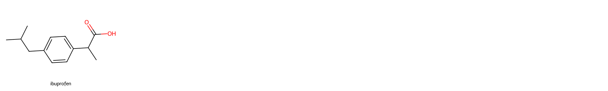

# core


<!-- WARNING: THIS FILE WAS AUTOGENERATED! DO NOT EDIT! -->

The following line loads the OpenRouter api key from the `.env` file
which is hidden from you. To use this notebook, either create a `.env`
file containing `OPENROUTER_API_KEY=your_api_key` or uncomment the
`os.environ` assignment below and set it to your personal api key.

``` python
load_dotenv("../.env")
# os.environ['OPENROUTER_API_KEY'] = <your OpenRouter api key>
```

    True

------------------------------------------------------------------------

<a
href="https://github.com/frenio/audette/blob/main/audette/core.py#L18"
target="_blank" style="float:right; font-size:smaller">source</a>

### show

>  show (string)

------------------------------------------------------------------------

<a
href="https://github.com/frenio/audette/blob/main/audette/core.py#L21"
target="_blank" style="float:right; font-size:smaller">source</a>

### Chat

>  Chat (model)

*Initialize self. See help(type(self)) for accurate signature.*

------------------------------------------------------------------------

<a
href="https://github.com/frenio/audette/blob/main/audette/core.py#L60"
target="_blank" style="float:right; font-size:smaller">source</a>

### Chat.save_conversation

>  Chat.save_conversation (generate_title=True)

``` python
model = "google/gemini-2.0-pro-exp-02-05:free"
chat = Chat(model)
```

``` python
chat("Give me the canonical SMILES string of ibuprofen. Output only the SMILES string and nothing else.")
```

CC(C)Cc1ccc(C(C)C(=O)O)cc1

``` python
from rdkit import Chem
from rdkit.Chem import Draw
```

``` python
names = ["ibuprofen"]
smiles = [chat.context[-1]['content']]

Draw.MolsToGridImage(mols=[Chem.MolFromSmiles(x) for x in smiles], 
                     molsPerRow=5, subImgSize=(400,300), legends=names)
```



``` python
chat.save_conversation(generate_title=False)
```

    'Saving complete!'

``` python
chat.save_conversation()
```

    'Saving complete!'

``` python
chat.title
```

    'ibuprofen-smiles-string-generation'

``` python
chat.usage
```

    [{'prompt_tokens': 21, 'completion_tokens': 20, 'total_tokens': 41},
     {'prompt_tokens': 73, 'completion_tokens': 9, 'total_tokens': 82}]

``` python
chat.usage_summary()
```

    Input tokens: 94
    Output tokens: 29
    Total tokens: 123

``` python
chat.date
```

    1740427285

------------------------------------------------------------------------

<a
href="https://github.com/frenio/audette/blob/main/audette/core.py#L81"
target="_blank" style="float:right; font-size:smaller">source</a>

### Chat.print_conversation

>  Chat.print_conversation (user='Me')

``` python
chat.print_conversation()
```

**Ibuprofen smiles string generation**

**Me**: Give me the canonical SMILES string of ibuprofen. Output only
the SMILES string and nothing else.

**Gemini**: CC(C)Cc1ccc(C(C)C(=O)O)cc1

------------------------------------------------------------------------

<a
href="https://github.com/frenio/audette/blob/main/audette/core.py#L92"
target="_blank" style="float:right; font-size:smaller">source</a>

### print_conversation

>  print_conversation (conversation, user='User', assistant='Assistant')

``` python
file_path = chat.chatsdir + chat.time + "-" + chat.title + ".txt"
assistant = file_path.split("/")[-2].split("-")[0].capitalize()

with open(file_path, 'r') as f:
    conv = f.read()
    
print_conversation(json.loads(conv), user="Me", assistant=assistant)
```

**Me**: Give me the canonical SMILES string of ibuprofen. Output only
the SMILES string and nothing else.

**Gemini**: CC(C)Cc1ccc(C(C)C(=O)O)cc1
